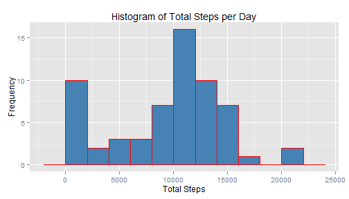
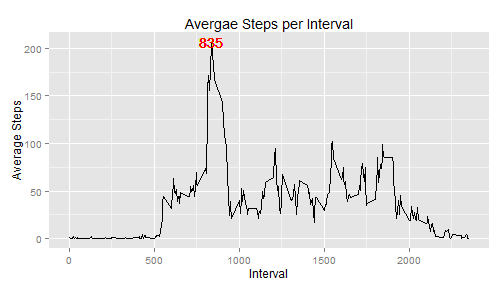
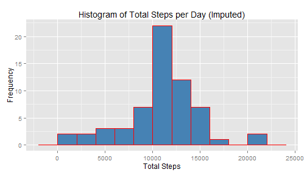
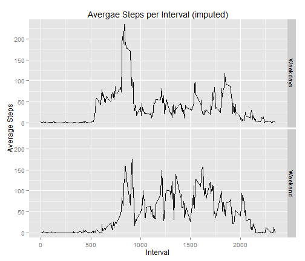

```r
opts_chunk$set(echo = TRUE)
## loading the necessary R packages
library(plyr)
library(ggplot2)
library(xtable)
```

Analyses of Daily Walking Activity of an Anonymous Individual
========================================================
Small portable devices can be used to monitor and collect data on personal activites.  An individual's daily walking activity was monitored and collected using such a device, during the two month-period of October and November of 2012.  The number of steps per every 5-minute interval per day was monitored and collected.    

The purposes of this project are (1) to manipulate this dataset to extract, summarize and present the statiscal summaries that are appropriate to our study questions, and furthermore (2) to integrate the manipulation processes and the resulting summaries in an R markdown file in a way to generate a document that colplies lierate statistcal programming.   


### 1.  Mean Total Number of Steps per Day

The first thing to do is to load the data set ("activity.csv") and process the data for further analyses.  I imported the data and named it "walk" and added a new variable "weekday" for based on the date.  The "weekday" variable" would be useful for the later parts of this project.


To generate a **histogram** showing the distribution of total daily steps taken and a **table** summarizing the daily walking activities of the individual, I generated a new data frame **"summaryTable"**.  


```r
# read the data frame 'activity.csv' in the working directory
walk <- read.csv("activity.csv")

# add new varibale 'weekday' and append
weekday <- weekdays(as.Date(walk$date, format = "%m/%d/%Y"))
walk <- cbind(walk, weekday)
walk$date <- as.character(walk$date)
walk$weekday <- as.character(walk$weekday)

sortweekdays <- function(x) {
    x <- replace(x, !(x %in% c("Saturday", "Sunday")), "Weekdays")
    x <- replace(x, x %in% c("Saturday", "Sunday"), "Weekend")
}
walk$weekday <- sortweekdays(walk$weekday)

summaryTable <- ddply(walk, c("date"), summarize, total = sum(steps, na.rm = T), 
    average = round(sum(steps, na.rm = T)/length(steps)), median = median(steps, 
        na.rm = T))

g <- ggplot(summaryTable, aes(total)) + geom_histogram(binwidth = 2000, fill = "steelblue", 
    col = "red")
g <- g + ggtitle("Histogram of Total Steps per Day") + xlab("Total Steps") + 
    ylab("Frequency")
print(g)
```

 


Here is the **Summary Table** showing the total steps, average steps per interval and medians per interval per day


```r
print(summaryTable, type = "html")
```

```
##          date total average median
## 1   10/1/2012     0       0     NA
## 2  10/10/2012  9900      34      0
## 3  10/11/2012 10304      36      0
## 4  10/12/2012 17382      60      0
## 5  10/13/2012 12426      43      0
## 6  10/14/2012 15098      52      0
## 7  10/15/2012 10139      35      0
## 8  10/16/2012 15084      52      0
## 9  10/17/2012 13452      47      0
## 10 10/18/2012 10056      35      0
## 11 10/19/2012 11829      41      0
## 12  10/2/2012   126       0      0
## 13 10/20/2012 10395      36      0
## 14 10/21/2012  8821      31      0
## 15 10/22/2012 13460      47      0
## 16 10/23/2012  8918      31      0
## 17 10/24/2012  8355      29      0
## 18 10/25/2012  2492       9      0
## 19 10/26/2012  6778      24      0
## 20 10/27/2012 10119      35      0
## 21 10/28/2012 11458      40      0
## 22 10/29/2012  5018      17      0
## 23  10/3/2012 11352      39      0
## 24 10/30/2012  9819      34      0
## 25 10/31/2012 15414      54      0
## 26  10/4/2012 12116      42      0
## 27  10/5/2012 13294      46      0
## 28  10/6/2012 15420      54      0
## 29  10/7/2012 11015      38      0
## 30  10/8/2012     0       0     NA
## 31  10/9/2012 12811      44      0
## 32  11/1/2012     0       0     NA
## 33 11/10/2012     0       0     NA
## 34 11/11/2012 12608      44      0
## 35 11/12/2012 10765      37      0
## 36 11/13/2012  7336      25      0
## 37 11/14/2012     0       0     NA
## 38 11/15/2012    41       0      0
## 39 11/16/2012  5441      19      0
## 40 11/17/2012 14339      50      0
## 41 11/18/2012 15110      52      0
## 42 11/19/2012  8841      31      0
## 43  11/2/2012 10600      37      0
## 44 11/20/2012  4472      16      0
## 45 11/21/2012 12787      44      0
## 46 11/22/2012 20427      71      0
## 47 11/23/2012 21194      74      0
## 48 11/24/2012 14478      50      0
## 49 11/25/2012 11834      41      0
## 50 11/26/2012 11162      39      0
## 51 11/27/2012 13646      47      0
## 52 11/28/2012 10183      35      0
## 53 11/29/2012  7047      24      0
## 54  11/3/2012 10571      37      0
## 55 11/30/2012     0       0     NA
## 56  11/4/2012     0       0     NA
## 57  11/5/2012 10439      36      0
## 58  11/6/2012  8334      29      0
## 59  11/7/2012 12883      45      0
## 60  11/8/2012  3219      11      0
## 61  11/9/2012     0       0     NA
```


### 2.  Pattern of Average Walkign Activity 

The next question is whether this individual's walking activity shows any kind of pattern, i.e. whether it shows a daily cycle of high and low activities.  To accomplish this, the "activity (walk)" dataset was split by the "interval" variable and the average steps for each 5-minute time intervals were calculated.  The following figure shows the time-series plot of average steps taken. 


```r
## new data frame 'stepPerInterval' splitted by 'interval'
stepsPerInterval <- ddply(walk, .(interval), summarize, average = mean(steps, 
    na.rm = T))
g <- ggplot(stepsPerInterval, aes(interval, average)) + geom_line()
g <- g + ggtitle("Avergae Steps per Interval") + xlab("Interval") + ylab("Average Steps")

maxStep <- max(stepsPerInterval$average, na.rm = T)
maxInterval <- stepsPerInterval$interval[stepsPerInterval$average == maxStep]
g <- g + geom_text(aes(maxInterval, maxStep), label = maxInterval, color = "red")
print(g)
```

 


#### This time series plot shows that this invidual's maximum walking activity is at the **835th interval**.  

### 3.  Missing Data Imputation 

```r
naCount <- sum(is.na(walk$steps))
```

The "activity"" data set has total **2304** missing values in the "steps" variable.  These missing values were discrded in the above analyses.  This process resulted in a very unlikely outcome of having 8 days of no walking day (i.e. zero total steps, see the table above).  

Assuming some degree of repeating patterns of personal activities based on working (weekdays)-nonworking (weekend) days and individual circadian cycle, my approach to resolve this issue is to replace the missing values with the average steps of each time interval after splitting the days to weekdays and weekends.  I used ddply() function of the *plyr* package to split the data.  The replacena() function is introduced to replace na's with the mean steps of corresponding intervals of a day (weekday or weekend separatley).  


```r
replacena <- function(x) {
    replace(x, is.na(x), round(mean(x, na.rm = T)))
}

imputedwalk <- ddply(walk, c("weekday", "interval"), transform, steps = replacena(steps))
imputedwalk <- imputedwalk[order(as.Date(imputedwalk$date), imputedwalk$interval), 
    ]

summaryTable1 <- ddply(imputedwalk, c("date"), summarize, total = sum(steps, 
    na.rm = T), average = round(mean(steps, na.rm = T)), median = median(steps, 
    na.rm = T))
```

The resulting **histogram** and Here is a modified **Summary Table** are shown below.  The number of days with less than 2,000 steps went down from 10 days to 2 days after changing the data.  

A noticeable change in the summary rable is in the median value.  The median steps were either 0 (for the days with at least one record for "steps") or NA (days with no record for "steps" variable).  However, the median values on the NA days were switched to non-zero values.


```r
h <- ggplot(summaryTable1, aes(total)) + geom_histogram(binwidth = 2000, fill = "steelblue", 
    col = "red")
h <- h + ggtitle("Histogram of Total Steps per Day (Imputed)") + xlab("Total Steps") + 
    ylab("Frequency")
print(h)
```

 


```r
print(summaryTable1, type = "html")
```

```
##          date total average median
## 1   10/1/2012 10176      35     24
## 2  10/10/2012  9900      34      0
## 3  10/11/2012 10304      36      0
## 4  10/12/2012 17382      60      0
## 5  10/13/2012 12426      43      0
## 6  10/14/2012 15098      52      0
## 7  10/15/2012 10139      35      0
## 8  10/16/2012 15084      52      0
## 9  10/17/2012 13452      47      0
## 10 10/18/2012 10056      35      0
## 11 10/19/2012 11829      41      0
## 12  10/2/2012   126       0      0
## 13 10/20/2012 10395      36      0
## 14 10/21/2012  8821      31      0
## 15 10/22/2012 13460      47      0
## 16 10/23/2012  8918      31      0
## 17 10/24/2012  8355      29      0
## 18 10/25/2012  2492       9      0
## 19 10/26/2012  6778      24      0
## 20 10/27/2012 10119      35      0
## 21 10/28/2012 11458      40      0
## 22 10/29/2012  5018      17      0
## 23  10/3/2012 11352      39      0
## 24 10/30/2012  9819      34      0
## 25 10/31/2012 15414      54      0
## 26  10/4/2012 12116      42      0
## 27  10/5/2012 13294      46      0
## 28  10/6/2012 15420      54      0
## 29  10/7/2012 11015      38      0
## 30  10/8/2012 10176      35     24
## 31  10/9/2012 12811      44      0
## 32  11/1/2012 10176      35     24
## 33 11/10/2012 12406      43     32
## 34 11/11/2012 12608      44      0
## 35 11/12/2012 10765      37      0
## 36 11/13/2012  7336      25      0
## 37 11/14/2012 10176      35     24
## 38 11/15/2012    41       0      0
## 39 11/16/2012  5441      19      0
## 40 11/17/2012 14339      50      0
## 41 11/18/2012 15110      52      0
## 42 11/19/2012  8841      31      0
## 43  11/2/2012 10600      37      0
## 44 11/20/2012  4472      16      0
## 45 11/21/2012 12787      44      0
## 46 11/22/2012 20427      71      0
## 47 11/23/2012 21194      74      0
## 48 11/24/2012 14478      50      0
## 49 11/25/2012 11834      41      0
## 50 11/26/2012 11162      39      0
## 51 11/27/2012 13646      47      0
## 52 11/28/2012 10183      35      0
## 53 11/29/2012  7047      24      0
## 54  11/3/2012 10571      37      0
## 55 11/30/2012 10176      35     24
## 56  11/4/2012 12406      43     32
## 57  11/5/2012 10439      36      0
## 58  11/6/2012  8334      29      0
## 59  11/7/2012 12883      45      0
## 60  11/8/2012  3219      11      0
## 61  11/9/2012 10176      35     24
```


### 4.  Comparison of Activity Patterns between Weekdays and Weekends


```r
## new data frame 'stepPerInterval' splitted by 'interval'
stepsPerInterval2 <- ddply(imputedwalk, .(weekday, interval), summarize, average = mean(steps, 
    na.rm = T))
f <- ggplot(stepsPerInterval2, aes(interval, average)) + geom_line()
f <- f + facet_grid(weekday ~ .)
f <- f + ggtitle("Avergae Steps per Interval (imputed)") + xlab("Interval") + 
    ylab("Average Steps")
print(f)
```

 

